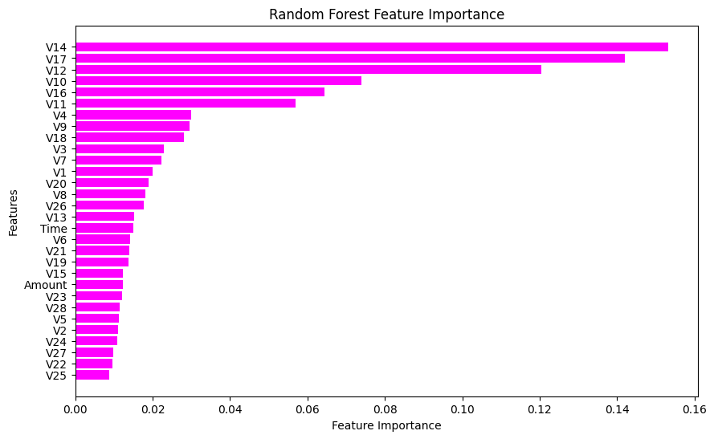
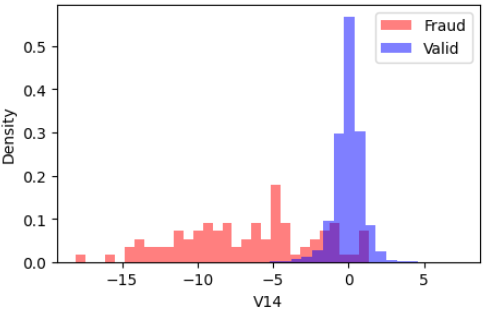
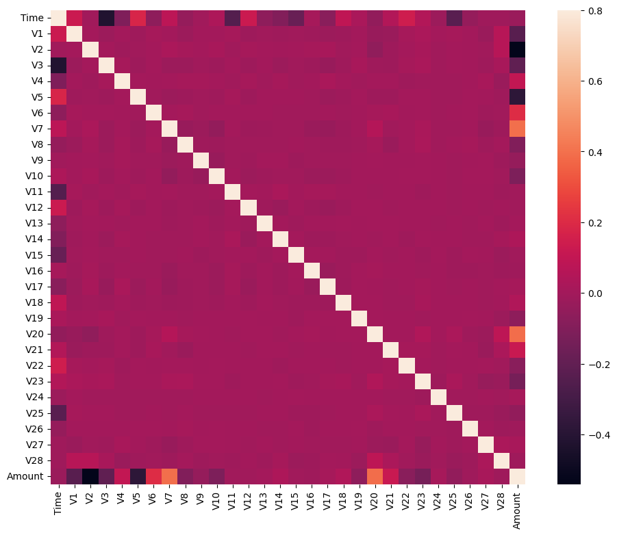
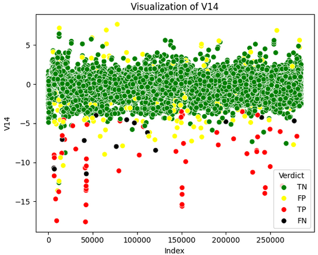

#  Credit Card Fraud Detection

Fraudulent transactions pose a major challenge for financial institutions, often hiding in massive volumes of legitimate activity. This project focuses on **credit card fraud detection** using **unsupervised machine learning** techniques to identify anomalies in transaction data — without relying on labeled fraud cases.

The system explores and compares models such as **Isolation Forest**, **One-Class SVM**, and **Local Outlier Factor**, leveraging their ability to detect abnormal behavior based on learned patterns of normal transactions.

Built with Python, the project uses **scikit-learn**, **pandas**, and **matplotlib**, and includes data preprocessing, feature selection, performance evaluation, and custom fraud verdict visualizations.

---

## Project Overview

Libraries used : `scikit-learn`, `pandas`, and `matplotlib`

### Tasks :

- **Data exploration & visualization**: To understand class distribution and feature behavior
- **Model training & evaluation**:
  - **Isolation Forest**
  - **Local Outlier Factor (LOF)**
  - **One-Class SVM**
- **Feature selection** using Random Forest to improve model efficiency
- **Performance metrics**: Precision, Recall, F1-score, Confusion Matrix
- **Custom visualization** of fraud detection results by model

---

## Motivation

Most real-world fraud detection problems are unsupervised in nature, meaning we often don't have reliable labeled data for fraudulent behavior. This project simulates that by testing how well models can learn patterns of "normal" behavior — and flag deviations that might represent fraud.

---

##  Exploratory Data Analysis

The dataset features 28 PCA-transformed variables (`V1` to `V28`), along with `Time`, `Amount`, and the target variable `Class` (0 = valid, 1 = fraud). We used histograms and density plots to visualize feature distributions and class imbalance.

---

##  Feature Importance (Random Forest)

Random Forest Classifier was used extract top features by importance.

With the most siginficant feature showing the below distribution :

---

##  Evaluation of the correlation between features

---

##  Model Performance & Verdict Visualization

Each model was evaluated with on classification metrics to specifically highlight:

- **TP**: Correctly identified fraud  
- **FN**: Missed fraud  
- **FP**: False alarms  
- **TN**: Correctly identified valid transactions  

### SVM Verdict Visualization (1 of 3 Models) 

We examine how the model performed in anomaly detection by examining a scatter of the most important feature after classification

##  Key Results & Insights

| Model                | Fraud Recall (%) | Fraud Precision (%) | F1-Score | False Positive Rate |
|---------------------|------------------|----------------------|----------|----------------------|
| Isolation Forest     | 59.5             | 59.0                 | 0.59     | 0.06%               |
| One-Class SVM        | 69.0             | 17.0                 | 0.28     | 0.49%               |
| Local Outlier Factor | ~0.0             | ~0.0                 | ~0.0     | 0.15%               |

- **Isolation Forest** had the best overall balance between fraud recall and false positive rate.
- **One-Class SVM** improved drastically with feature reduction and scaling, but at some cost in precision.
- **LOF** was not well-suited for this dataset without further tuning or context.

